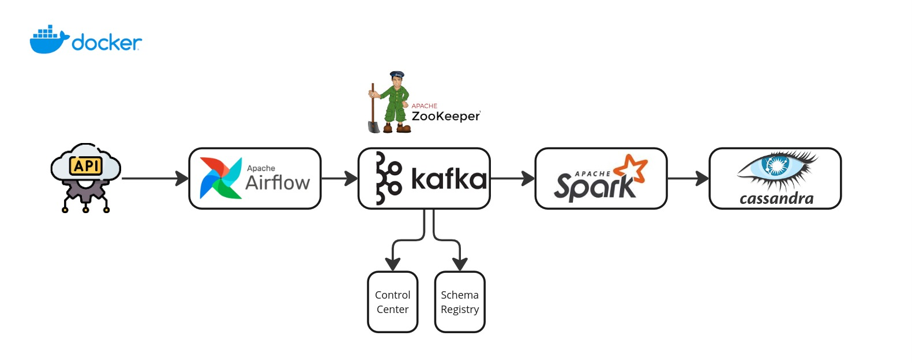

# Data Ecosystem with Kafka, Spark, Airflow, and Cassandra

Este repositório configura um ecossistema de dados utilizando **Apache Kafka**, **Apache Spark**, **Apache Cassandra**, **Apache Airflow** e outras tecnologias relacionadas, com o objetivo de fornecer um ambiente robusto para processamento de dados em tempo real e batch. Ele inclui uma série de serviços para gerenciar dados, monitoramento e orquestração.

## Visão Geral

A arquitetura é composta pelos seguintes componentes:

- **Kafka**: Sistema de mensagens distribuído para stream de dados em tempo real.
- **Zookeeper**: Gerenciador de coordenação para o Kafka.
- **Spark**: Framework de processamento distribuído para batch e stream processing.
- **Airflow**: Orquestrador de workflows para automação de tarefas.
- **Cassandra**: Banco de dados NoSQL distribuído para armazenamento de dados.
- **Schema Registry**: Gerenciamento de esquemas para validação de dados.
- **Control Center**: Interface para monitoramento e gerenciamento do Kafka.

### Arquitetura

O arquivo `docker-compose.yml` define os seguintes serviços:

1. **Zookeeper**: Gerencia a coordenação do Kafka.
2. **Broker Kafka**: Serve como o ponto de ingestão e publicação de dados no Kafka.
3. **Schema Registry**: Gerencia esquemas de dados para garantir consistência e validação.
4. **Control Center**: Interface gráfica para monitoramento do Kafka.
5. **Airflow (Webserver e Scheduler)**: Orquestração de tarefas e execução de pipelines de dados.
6. **Spark Master e Worker**: Processamento distribuído de dados utilizando Apache Spark.
7. **Cassandra**: Banco de dados NoSQL para armazenar dados processados.

### Fluxo de Trabalho




1. **Produção de Dados**: Os produtores enviam dados para o **Kafka Broker**. Esses dados podem ser consumidos por diferentes consumidores, como Spark e Airflow.
2. **Processamento de Dados**: O **Spark** é utilizado para processar grandes volumes de dados em tempo real (streaming) ou em batch, com os dados sendo ingeridos diretamente do Kafka.
3. **Armazenamento**: Após o processamento, os dados podem ser armazenados no **Cassandra**.
4. **Orquestração**: **Airflow** é utilizado para orquestrar pipelines e automação de tarefas dentro do ecossistema de dados.

## Pré-requisitos

Para rodar este ambiente, você precisa dos seguintes pré-requisitos instalados:

- **Docker** (versão 20.10 ou superior)
- **Docker Compose** (versão 1.29 ou superior)

Você pode verificar a versão instalada do Docker com o comando:

```bash
docker --version
```

E a versão do Docker Compose com:

```bash
docker-compose --version
```

## Como Usar

### Passo 1: Clone o Repositório

Clone este repositório em sua máquina local:

```bash
git clone https://github.com/seu-usuario/seu-repositorio.git
cd seu-repositorio
```

### Passo 2: Inicie os Serviços

No diretório onde o arquivo `docker-compose.yml` está localizado, execute o seguinte comando para iniciar todos os serviços:

```bash
docker-compose up -d
```

Isso fará o download das imagens necessárias e iniciará os containers. O `-d` faz com que os containers sejam executados em segundo plano.

### Passo 3: Verifique se os Containers Estão em Execução

Verifique os containers em execução com o comando:

```bash
docker-compose ps
```

Isso mostrará o status de todos os containers.

### Passo 4: Acesse as Interfaces

- **Kafka**: O Kafka estará disponível na porta `9092` e o painel de monitoramento do **Control Center** pode ser acessado na porta `9021`.
- **Airflow**: A interface web do **Airflow** estará disponível na porta `8080`.
- **Spark**: O UI do **Spark** Master estará disponível na porta `9090`.

### Passo 5: Parar os Serviços

Para parar os serviços, execute o seguinte comando:

```bash
docker-compose down
```

Isso irá parar todos os containers, mas os volumes persistentes serão mantidos.

## Detalhes de Configuração

### Zookeeper

- **Imagem**: `confluentinc/cp-zookeeper:7.4.0`
- **Porta**: 2181
- **Configuração**: A variável de ambiente `ZOOKEEPER_CLIENT_PORT` define a porta do cliente, enquanto `ZOOKEEPER_TICK_TIME` ajusta o intervalo de tempo do Zookeeper.

### Kafka Broker

- **Imagem**: `confluentinc/cp-server:7.4.0`
- **Portas**:
  - `9092`: Porta interna de comunicação do Kafka.
  - `9101`: Porta do JMX para monitoramento.
- **Configuração**: As variáveis de ambiente incluem a configuração do Zookeeper, dos listeners e do Schema Registry.

### Schema Registry

- **Imagem**: `confluentinc/cp-schema-registry:7.4.0`
- **Porta**: 8081
- **Configuração**: A variável `SCHEMA_REGISTRY_KAFKASTORE_BOOTSTRAP_SERVERS` define o endereço do Kafka.

### Airflow

- **Imagem**: `apache/airflow:2.6.0-python3.9`
- **Porta**: 8080
- **Configuração**: O Airflow é configurado com um banco de dados PostgreSQL para persistência.

### Spark

- **Imagem**: `bitnami/spark:latest`
- **Portas**:
  - `9090`: UI do Spark Master.
  - `7077`: Porta de comunicação entre Master e Workers.
- **Configuração**: O Spark é configurado com workers e master em um cluster.

### Cassandra

- **Imagem**: `cassandra:latest`
- **Porta**: 9042
- **Configuração**: Variáveis de ambiente para configurar o heap de memória e as credenciais de acesso.

## Monitoramento

Você pode monitorar a saúde e o status de todos os serviços usando o painel do **Control Center** em `http://localhost:9021`. Para detalhes do Kafka, o Control Center oferece uma interface rica para visualização de tópicos, consumidores e configurações de Kafka.

## Personalização

Você pode personalizar o arquivo `docker-compose.yml` para ajustar a quantidade de memória, CPU e outras configurações conforme necessário para o seu ambiente de desenvolvimento ou produção.

### Comandos (Cassandra)

```bash
docker exec -it cassandra cqlsh -u cassandra -p cassandra localhost 9042

select * from spark_streams.created_users
```

### Exemplo de Modificação para Spark

Para ajustar os recursos do Spark Worker:

```yaml
spark-worker:
  environment:
    SPARK_WORKER_CORES: 2
    SPARK_WORKER_MEMORY: 2g
  deploy:
    resources:
      limits:
        cpus: "2.0"
        memory: 2g
```
